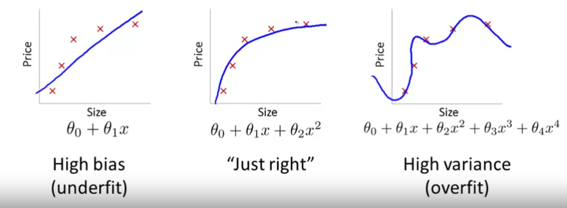

# Bias vs Variance

## Definition
*Bias - предвзятость, необъективность, flattess.*  
*Variance - расхождение, изменение, разногласие, curved.*  

## Identify bias or variance error by train and cross-validation error:
Bias: J-train and J-cv are both high and very similar  
Variance: J-train is small and J-cv is much smaller  

## Regularization and Bias/Variance
For small regularization parameter (lambda) there's a risk of getting into model overfitting (high variance).  
Bias: J-train and J-cv are both high, lambda relatively big  
Variance: J-train small and J-cv is much smaller, lambda relatively small  

## Learning curves
Increasing training dataset size isn't always good idea.  
J-train will always be the smallest, and J-cv most likely to be huge, here's why:  
   * Let's m=1 -> perfect fit for J-train, and almost random for J-cv  
   * m=3 -> still almost perfect fit for J-train, and almost random for J-cv  
   * m=10 -> a little worse fit for J-train, and a little better for J-cv  
and so on...  

*High variance*: with overfitted model will be big difference betwee J-train and J-cv. But increasing dataset will anyway decrease the variance and so bring closer J-cv to the J-train.  

*High bias*: again, in the beginning, J-train - good, J-cv - bad. But due to low variance, J-train won't be small enough and J-cv as well. Also increasing size of dataset won't change the picture at all.  

## General guide
    * Getting more training examples: *Fixes high variance*
    * Trying smaller sets of features:*Fixes high variance*
    * Adding features: *Fixes high bias*
    * Adding polynomial features: *Fixes high bias*
    * Decreasing λ: *Fixes high bias*
    * Increasing λ: *Fixes high variance.*
    * Check error of cross-validation instead of test: *Fixes high variance*

### Neural Networks:
Small NN more prone to underfitting, as very little parameters (number of units and layers == number of parameters).  
Big NN are more prone to overfitted, but can be smoothed out by regularization. The only issue - more computational cost.  

