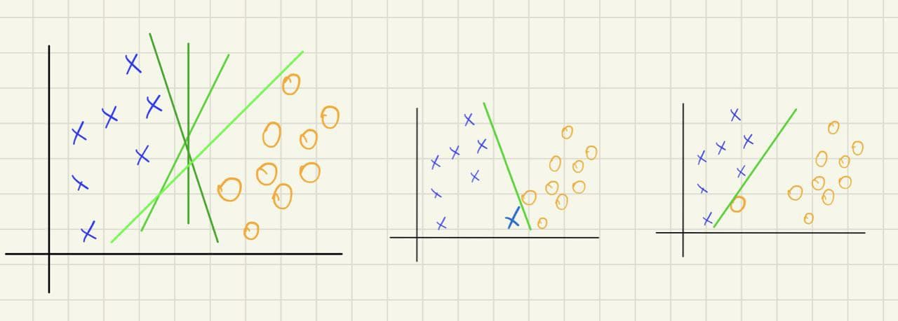

# Support vector machines

## Logistic regression problems
1. Very close to separate catergories desicion boundary line, without any margin
2. Outliers sensitivity
3. Non-linearly separable data

## Solution 
Create 'smart' desicion boundary with margin and ignore outliers as much as possible. In other words depend not on the data by itself, but on it's similarity.

## Another perspective
The more crowded some certain area of the same points around sample - the more likely the sample belongs to the same group.

## How to measure the crowd
Just as in logistic regression, theta weights will be much bigger for some certain features of the same group, and low for other.

## Non-linearly separable data problem
The biggest problem is when data can't be linearly separated into groups. The solution - increase dimensionality (kind of, this is called *the kernel trick*). This is done by adding additional polynomial features, and increase of dimensionality allows to find some linear hyperplane by which data can be separated.

How to increase dimensionality - add more polynomial features based on existing ones, e.g if samples are 1d, add squared x as a second feature.  
But instead of transformation existing data, dimensionality increase can be accomplished inside similarity functions, a.k.a the kernels.

## Landmarks
Given sample, find it's class depending on the landmarks. Landmarks are actually all sample points of training data set. The task is to figure out is given example close 

## SVM training
Minimizing error function is quite similar to logistic regression's one.  
**LR:** `min θ = -1/m Σ(y * log(h(θ'X)) - (1-y) * log(1 - log(h(θ'X)))) + λ * Σ(θ^2)`, where `h(θ'X) = 1 / 1 + e ^ (-θ'X)`
**SVM:** `min θ = C * Σ(y * cost1(θ'F) - (1-y) * cost2(θ'F)) + 1/2 * Σ(θ^2)`
Differences:
1. Removed 1/m term, as for minification it won't work at all (example: `min x -> (10 - x) * 5 -> x = 10; min x -> (10 - x) -> x = 10`).
2. Lambda term is moved to the first part, C = 1/λ. So the only way to minimize regularization - minimize C term.
3. Cost funnction now strictly returns 0 if the sample is correctly predicted, and linearly proportional to incorrect result. it's accomplished by 
4. Kernelized F features instead of sample's regular X features.

## SVM cost function
E.g Gaussian kernel (radial basis function, RBF) = exp(-||x - lm||^2 / 2 * σ^2) - exponential distance from point x to landmark m. If point and landmark are very close - kernel will be close to 0, and close to 1 otherwise.
Cost function takes a point and computes kernel for every landmark (other xs from training dataset), then sums all the distances. Then those distances are multiplied by theta parameters, returning 0 when distances sum are >= 1 for y = 1 and <= -1 for y = 0, linear proportion of error otherwise. Most crowded areas (landmarks) will recieve bigger thetas, as it is most likely the charasteristics of the belonginess to a certain class.

## SVM regularization
Regularization part here is why margins and optimal desicion boundary are created. If C is very small, or the cost is very small, thetas itself should be quite small as well. This is reached by calculation of sums of projections on the theta vector. The bigger the number is - the further support vectors are located, as the desicion boundary vector and theta vector are orthogonal.

## Evaluation algorithm with given sample x
1. Compute new features according to each landmark (m new features, as each landmark stands for each training exampe). In other words collect the sum of distances to each point
2. Each feature f1, f2, ..., fm are generated by similarity function (kernel).
3. Multiply by theta weights and find out is it > or < 0.

## SVM parameters
SVM parameters are basically showing how concetrated some points are. Let's say we have in total 10 points. 3 of them - f1, f2, f3 are pretty close to each other and belong to the same class, then theta1, theta2, theta3 are very likely will have big weight (+ or - associated with class) as if example has very short distances to these points, thetas will highlight it among all other points.

